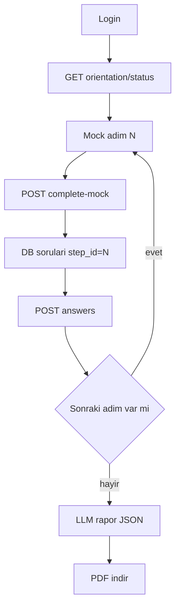

# Oryantasyon: mock adımlar → hazır soru → PDF

Mevcut repo hâlâ [dış kanal LangGraph CLI](graph.py). Bu görev **iç kanal oryantasyon dilimi**; mevcut `nodes/` radar düğümlerine dokunulmaz. LangGraph **yok**. Sorular LLM ile üretilmez; PostgreSQL’de hazır tutulur.

**Öncelik: soru-cevap sistemi.** Elde gerçek video yok; eğitim adımları mock kayıt. Player, YouTube veya animasyon bu dilimde yok. Video yerine “Modül N tamamlandı” sahte eylemi sırayı ilerletir; kilit ve skor tamamen quiz üzerinden yürür.

**Akış kuralları**
- Yeni çalışan login sonrası eğitim sırasına düşer.
- Mock adım N “izlendi” işaretlenir → o adıma bağlı DB soruları gelir.
- Cevaplar gönderilmeden adım N+1 kilitli kalır.
- Son adım + son quiz bitince rapor üretilir; kullanıcı PDF indirir.



## Varsayımlar

- Sorular çoktan seçmeli; doğru şık DB’de. Geçiş için **cevaplamak** yeterli; skor rapora yazılır.
- LLM yalnızca rapor metnini üretir. Skor SQL + cevap anahtarından hesaplanır.
- Kilit kapsamı: **eğitim adımları arası**. İzin/chatbot kilidi bu dilimde yok.
- Yeni çalışan: `orientation_results.completed_at IS NULL`.
- `orientation_videos` tablosu şema uyumu için kalır ama içerik mock: `source_url` boş/placeholder, süre sahte.

## 1. PostgreSQL şema

Alembic + SQLAlchemy:

- `employee_profiles`: `id`, `email`, `full_name`, `hire_date`, `department`
- `orientation_videos`: `id`, `title`, `description`, `source_url` (nullable mock), `duration_seconds` (sahte), `sort_order`, `is_required`
- `orientation_questions`: `id`, `video_id` (FK), `prompt`, `choices` (JSONB), `correct_index`, `sort_order`
- `orientation_watch_events`: `employee_id`, `video_id`, `completed_at` — demo’da `POST .../complete` ile yazılır (yüzde takibi şart değil)
- `orientation_answers`: `employee_id`, `question_id`, `selected_index`, `is_correct`, `answered_at`
- `orientation_results`: `scores_json`, `report_summary`, `completed_at`

Seed: 3 mock modül (ör. “Şirket tanıtımı”, “İş güvenliği”, “İK süreçleri”), her birine 2–3 hazır soru; bir yeni çalışan, bir tamamlamış çalışan.

Ayarlar: `DATABASE_URL`. `ORIENTATION_MIN_WATCH_PERCENT` gerekmez; mock complete yeter.

**Kapı:**

```python
def can_unlock_step(employee_id, step) -> bool:
    prev = previous_required_step(step)
    if prev is None:
        return True
    return marked_complete(prev) and all_questions_answered(prev)
```

`GET/POST questions`: adım complete değilse `409`. Sonraki adım: önceki quiz eksikse `403 STEP_LOCKED`.

## 2. FastAPI — `/api/v1/hr/orientation`

Düz servis + route; LangGraph yok.

- `GET /status` — `{ current_step_id, locked_step_ids, quiz_pending, completed, report_ready }`
- `GET /videos` (veya `/steps`) — mock adımlar + `unlocked` / `completed` / `quiz_done`
- `POST /videos/{id}/complete` — mock “izlendi”; gerçek progress yok
- `GET /videos/{id}/questions` — **doğru şık dönülmez**
- `POST /videos/{id}/answers` — skor hesapla; sonraki adımı aç
- `GET /report` — tamamlanmadan `409`
- `GET /report/pdf` — binary PDF

[mocks/llm.py](mocks/llm.py) `complete()` + yeni `OrientationReport` şeması; `ISO_PULSE_USE_MOCK_LLM=true` iken sabit Türkçe özet.

## 3. Basit LLM (rapor only)

Son quiz submit’inden sonra tek çağrı: doğru/yanlış sayıları + yanlış soru metinleri → `summary`, `strengths[]`, `gaps[]`, `recommendation`. Snapshot `orientation_results`’a yazılır; PDF tekrar LLM çağırmaz.

## 4. Demo yüzeyi (quiz-first)

Tek HTML veya ince sayfa:

- Adım kartı: başlık + kısa mock açıklama; video oynatıcı **yok**
- “Eğitimi tamamladım” → soru formu açılır
- “Sonraki adım” quiz bitmeden disabled
- Bitişte **PDF indir**

Docker Compose: `postgres` + `api`. Radar `graph.py` ayrı kalır.

## 5. Uygulama sırası

1. Compose + migration + mock seed (adımlar + hazır sorular)
2. Kilit fonksiyonları + birim test
3. status / complete / questions / answers API
4. Rapor LLM + PDF
5. Quiz UI (player yok)
6. Atlama 403; sırayla bitirme; PDF 200

## Bilinçli sınırlar

- Gerçek video dosyası, player, YouTube entegrasyonu yok; sonra `source_url` doldurulabilir
- ChromaDB, izin, Guardrail, İzin_Node yok
- Sorular asla LLM’den üretilmez
- Gerçek SSO yok; demo `employee_id` header veya basit login
