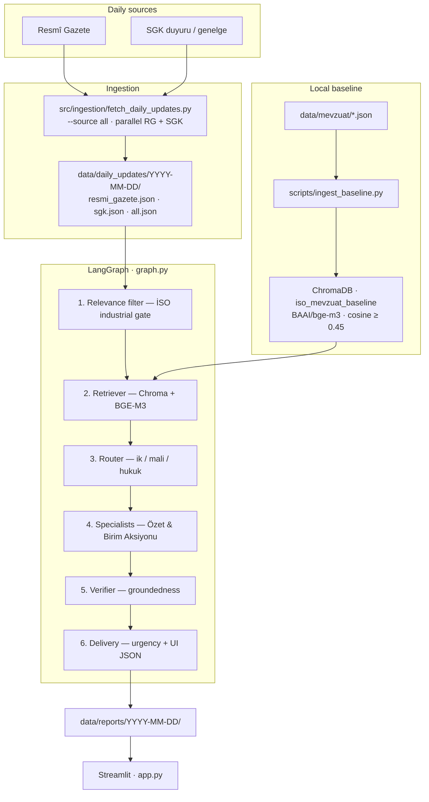
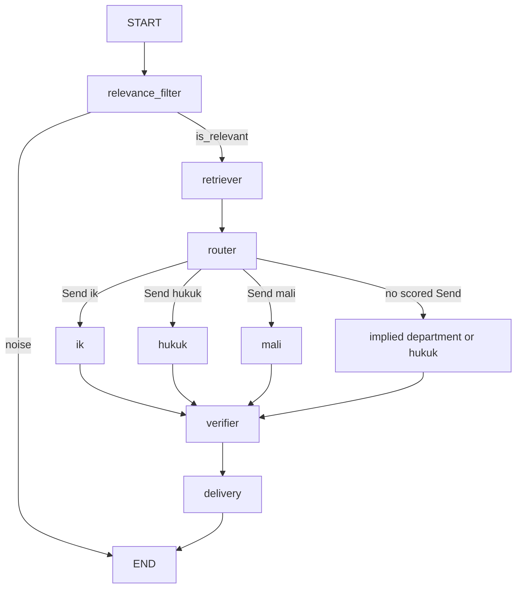

# İSO PULSE — Mevzuat Radar

On-premise, **data-sovereign** regulatory intelligence platform for the **Istanbul Chamber of Industry (İSO)**.

The radar watches daily Turkish legal publications, drops administrative noise, matches surviving items against a local statute baseline, and writes department-level impact reports for industrial employers. Statute text and gazette payloads stay on the machine: generation runs on **Qwen 2.5 (7B)** via local **Ollama**. A deterministic Fast Mock path (`ISO_PULSE_USE_MOCK_LLM=true`) is available for UI and pipeline tests.

---

## System overview

End-to-end path:

**Ingestion (Resmî Gazete + SGK)** → **Relevance Filter** → **Vector Retriever (ChromaDB + BGE-M3)** → **Router** → **Specialist Agents (İK, Maliye, Hukuk)** → **Verifier** → **Delivery / Streamlit**



No statute JSON is crawled from mevzuat.gov.tr (robots.txt forbids it). Consolidated kanun files are produced offline from manually downloaded PDFs — see [`OKUBENI.md`](OKUBENI.md).

### LangGraph

Compiled in [`graph.py`](graph.py). Specialists fan out with LangGraph `Send`. A department is opened only when router confidence ≥ **0.75** and [`config/routing.py`](config/routing.py) agrees that department’s **core domain** changed.



| Node | Role |
| --- | --- |
| `relevance_filter` | İSO industrial gate — keep labor/tax/environment/trade; drop true noise |
| `retriever` | Cosine search on `iso_mevzuat_baseline`; inject `old_text` only on a valid hit |
| `router` | `ik` / `mali` / `hukuk` with a 0.75 floor and negative constraints |
| `ik` · `mali` · `hukuk` | Department analysis: Eski/Yeni when matched; Özet + Birim Aksiyonu always |
| `verifier` | Hallucination / domain-signal audit |
| `delivery` | Urgency (Düşük / Orta / Kritik) and UI JSON |

---

## Technology stack

| Layer | Choice | Notes |
| --- | --- | --- |
| Runtime | Python **3.11+** | [`pyproject.toml`](pyproject.toml) |
| Orchestration | **LangGraph** | `PulseState` in [`graph.py`](graph.py) |
| LLM | **Qwen 2.5 (7B)** via **Ollama** | `http://localhost:11434` — data stays local |
| Fast Mock | Structured Pydantic mocks | `ISO_PULSE_USE_MOCK_LLM=true` |
| Embeddings | **BAAI/bge-m3** | Local SentenceTransformer |
| Vector DB | **ChromaDB** | `./data/chroma_db`, collection `iso_mevzuat_baseline`, HNSW **cosine** |
| Ingestion | **httpx** + BeautifulSoup | PDF via **pypdf** / **pdfplumber** |
| UI | **Streamlit** [`app.py`](app.py) | İSO navy `#003366` · gold `#C5A572` |

---

## Ingestion and multi-source support

[`src/ingestion/fetch_daily_updates.py`](src/ingestion/fetch_daily_updates.py) runs **Resmî Gazete and SGK in parallel** when `--source all` (the default). Each row is tagged `source: resmi_gazete` or `source: sgk`. The daily payload is `all.json` (RG ∪ SGK). It also writes a separate `change_report.json` with per-item `new`, `changed`, `unchanged`, or `unverified` status, using SHA-256 over normalized title, category, and extracted text. Comparison state is kept under `data/daily_updates/.change_tracking/`; missing items are not treated as deletions because collection coverage may be partial. The report includes requested sources, observed counts, and failed-source names. The existing `all.json` format and app/pipeline behavior are unchanged.

```bash
python3 -m src.ingestion.fetch_daily_updates --source all --date YYYY-MM-DD
```

| Scraper | Target | Behaviour |
| --- | --- | --- |
| `resmi_gazete.py` | `resmigazete.gov.tr/eskiler/YYYY/MM/YYYYMMDD.htm` | YÜRÜTME VE İDARE: Kanun, Cumhurbaşkanı Kararı, Yönetmelik, Tebliğ |
| `sgk_scraper.py` | `sgk.gov.tr/duyuru/` | Latest duyuru / genelge cards + attached PDFs |
| `mevzuat_scraper.py` | Local `data/mevzuat` + that day’s RG | Tracks cited kanun numbers; **never HTTP-gets mevzuat.gov.tr** |

SGK rows carry `baseline_document_ids: ["law:5510", "law:4447"]` so the retriever prefers Sosyal Sigortalar and İşsizlik Sigortası vectors.

See [daily change tracking](docs/daily-change-tracking.md) for status meanings,
failure reporting, validation commands, and coverage limits. A source exception
now produces exit code 1 while preserving records collected from other sources.

---

## Relevance filter — İSO industrial gate

Implemented in [`config/relevance.py`](config/relevance.py) and [`nodes/relevance_filter.py`](nodes/relevance_filter.py). Mock and live pre-filter share the same taxonomy. Keep-class labor/tax signals beat incidental `atama` words in a document body.

**Kept** (`is_relevant = true`) — must reach Retriever and a specialist:

- **Labor & HR** — 4857, 5510, 6331, asgari ücret, çalışma izni, sözleşmeli personel / personel esasları, çalışma koşulları, istihdam, harcırah
- **Tax & finance** — ÖTV, KDV, kurumlar / gelir vergisi, stopaj, gümrük, teşvik, energy tariffs
- **Environment & trade** — Yeşil Mutabakat, karbon, atık, ithalat/ihracat kotası, üretim standardı, çevre izin
- **Legal / ops** that bind the employer — KVKK, lisans, faaliyet durdurma

**Dropped** (`is_relevant = false`) — never retrieved:

- UN / BM Güvenlik Konseyi asset freezes and named-entity sanction lists (`1267`, malvarlığının dondurulması)
- Municipal / spatial noise — imar, belediye sınırı, Teknokent **coordinate / kroki** updates
- Localized public-land expropriation (acele kamulaştırma of a named parcel)
- University rector, diplomatic, or person-specific appointment titles
- Institutional noise — university exam yönetmelikleri, jandarma social-facility rules

A Teknokent **tax incentive** is kept. A Teknokent **kroki** is dropped.

---

## Baseline corpus and ChromaDB

JSON lives under [`data/mevzuat/`](data/mevzuat/). Indexer: [`scripts/ingest_baseline.py`](scripts/ingest_baseline.py) (alias of [`scripts/index_mevzuat.py`](scripts/index_mevzuat.py)). Active provisions are embedded with BGE-M3; `mulga` rows are skipped; upserts are batched (100) and idempotent by `provision_id`.

### Labor & HR

| File | Statute |
| --- | --- |
| `4857_is_kanunu.json` | İş Kanunu |
| `5510_sosyal_sigortalar.json` | Sosyal Sigortalar ve Genel Sağlık Sigortası Kanunu |
| `6331_isg_kanunu.json` | İş Sağlığı ve Güvenliği Kanunu |
| `4447_issizlik_sigortasi.json` | İşsizlik Sigortası Kanunu |
| `4632_bireysel_emeklilik.json` | Bireysel Emeklilik Kanunu |
| `6698_kvkk.json` | Kişisel Verilerin Korunması Kanunu |
| `5174_tobb_odalar_borsalar.json` | TOBB / odalar ve borsalar |

### Tax & finance (expanded corpus)

| Kanun no | Statute | Chroma `document_id` |
| --- | --- | --- |
| **4760** | Özel Tüketim Vergisi Kanunu | `law:4760` |
| **3065** | Katma Değer Vergisi Kanunu | `law:3065` |
| **193** | Gelir Vergisi Kanunu | `law:193` |
| **5520** | Kurumlar Vergisi Kanunu | `law:5520` |

Add tax JSON the same way as labor files, then re-run the indexer. Offline PDF → madde JSON:

```bash
python3 scripts/pdf_to_madde_json.py 4760_indirilen.pdf \
    --no 4760 --baslik "Özel Tüketim Vergisi Kanunu" \
    --url "https://www.mevzuat.gov.tr/MevzuatMetin/1.5.4760.pdf" \
    --cikti data/mevzuat/4760_otv.json
```

---

## Retriever, specialists, and UI

**Matching.** Cosine similarity must be ≥ **0.45**, and the hit needs a legal connection (shared statute id or non-generic tokens). Weak or unrelated Chroma rows are not written into `old_text`. SGK items are scoped to `law:5510` and `law:4447`.

**Valid match.** Specialists write a Turkish side-by-side in `obligation_change`:

- `Eski durum: …`
- `Yeni durum: …`

plus a concrete **Birim Aksiyonu**.

**No valid match.** They include:

> Mevcut taban kanunlarda doğrudan eşleşen madde bulunamamıştır. Bağımsız yeni yükümlülüktür.

and still analyze the **new** text:

- **Özet & Değişiklik** — two sentences on what the karar/rate actually imposes
- **Birim Aksiyonu (Maliye / Finans | İnsan Kaynakları (İK) | Hukuk & Mevzuat)** — operational steps (e.g. “ÖTV tutarları güncellenmeli, muhasebe/ERP vergi kodları revize edilmelidir.”)

They never force İş Kanunu m.41 or an SGK madde onto an unrelated gazette item (UN lists, maps, ÖTV when no 4760 hit, and so on).

**Streamlit** ([`app.py`](app.py)) maps internal codes to badges:

| Code | Badge |
| --- | --- |
| `mali` / `maliye` | **Maliye / Finans** |
| `ik` | **İnsan Kaynakları (İK)** |
| `hukuk` | **Hukuk & Mevzuat** |

The items tab shows Eski (Chroma baseline) vs Yeni (gazette/SGK) columns, then the specialist özet and aksiyon.

**Router examples**

| Operative text | Route |
| --- | --- |
| Overtime / payroll, no tax-base change | **İK** only |
| ÖTV / KDV tutar or rate change | **Maliye / Finans** |
| Çevre izin / licensing | **Hukuk & Mevzuat** |
| Wage **and** tax instrument + threshold | **İK** + **Maliye / Finans** |
| UN freeze / Teknokent kroki / appointment | Filter drop → `END` |

---

## Quick start

```bash
python3 -m venv .venv
source .venv/bin/activate
pip install -r requirements.txt
cp .env.example .env
```

Pull Qwen for the live, data-sovereign path:

```bash
ollama pull qwen2.5:7b
```

Then:

```bash
# 1. Embed baseline statutes (labor + any tax JSON under data/mevzuat/)
python3 scripts/ingest_baseline.py

# 2. Fetch Resmî Gazete + SGK in parallel
python3 -m src.ingestion.fetch_daily_updates --date YYYY-MM-DD --source all

# 3. Run LangGraph and write executive reports
python3 scripts/run_pipeline.py --date YYYY-MM-DD --source all
```

Dashboard (fetch, pipeline, Fast Mock, Chroma search):

```bash
streamlit run app.py
```

Useful flags:

```bash
python3 -m src.ingestion.fetch_daily_updates --source sgk
python3 -m src.ingestion.fetch_daily_updates --source resmi_gazete --max-items 5
python3 scripts/run_pipeline.py --date YYYY-MM-DD --source all --limit 3
ISO_PULSE_USE_MOCK_LLM=true python3 scripts/run_pipeline.py --date YYYY-MM-DD --limit 3
```

Reports: `data/reports/YYYY-MM-DD/summary.md` and `data/reports/YYYY-MM-DD/items/*.json`.

The first index run downloads **BGE-M3** and embeds active provisions; later runs upsert by `provision_id`.

### Environment

Copy [`.env.example`](.env.example) to `.env`. If `ISO_PULSE_USE_MOCK_LLM` is unset, settings default the mock LLM to **true**.

| Variable | Meaning |
| --- | --- |
| `ISO_PULSE_USE_MOCK_LLM` | `true` = Fast Mock; `false` = ChatOllama / Qwen 2.5 |
| `OLLAMA_BASE_URL` | Default `http://localhost:11434` |
| `MODEL_NAME` | Ollama tag, e.g. `qwen2.5:7b` |
| `ISO_PULSE_TEMPERATURE` | Default `0` |
| `CHROMA_PERSIST_DIR` | Default `data/chroma_db` |
| `CHROMA_COLLECTION` | Default `iso_mevzuat_baseline` |
| `EMBEDDING_MODEL` | Default `BAAI/bge-m3` |
| `DAILY_UPDATES_DIR` | Default `data/daily_updates` |
| `REPORTS_DIR` | Default `data/reports` |

---

## Project structure

```
iso-pulse-platform/
├── graph.py                      # Compiled StateGraph(PulseState)
├── app.py                        # Operations dashboard
├── main.py                       # Fixture CLI
├── config/                       # Settings, prompts, relevance gate, routing
├── schemas/                      # PulseState + department labels
├── nodes/                        # Filter, retriever, router, specialists, verifier
├── mocks/                        # Mock LLM + Chroma/in-memory retriever
├── src/ingestion/                # Parallel RG + SGK scrapers
├── scripts/
│   ├── ingest_baseline.py        # Embed data/mevzuat → Chroma
│   ├── index_mevzuat.py          # Same indexer (implementation)
│   ├── run_pipeline.py           # Daily JSON → graph → reports
│   └── pdf_to_madde_json.py      # Offline PDF → madde JSON
├── data/mevzuat/                 # Baseline statutes
├── data/chroma_db/               # Persistent Chroma (gitignored)
├── data/daily_updates/           # Scraper output
├── data/reports/                 # summary.md + items/*.json
└── OKUBENI.md                    # Manual mevzuat.gov.tr PDF refresh
```

---

## Fixture CLI

Same compiled graph, sample events in [`mocks/documents.py`](mocks/documents.py):

```bash
python main.py --list
python main.py --doc ik-overtime
python main.py --doc otv-rate
python main.py --doc noise-appointment
```

| `--doc` | Expected path |
| --- | --- |
| `noise-appointment` | Filter drop → `END` |
| `ik-overtime` | İK, Eski/Yeni |
| `otv-rate` | Maliye / Finans, independent-obligation özet + aksiyon |
| `hukuk-environment` | Hukuk & Mevzuat |
| `multi-wage-tax` | İK + Maliye / Finans |

---

## Outputs

Pydantic models in [`schemas/outputs.py`](schemas/outputs.py): `RelevanceResult`, `RouteDecision`, `DepartmentAnalysis`, `VerificationResult`, `DeliveryPayload`.

```
data/reports/YYYY-MM-DD/
├── summary.md          # Executive list (human-readable birim names)
├── items.json          # Combined log
└── items/*.json        # Per-item delivery, RAG hits, audit trail
```

If Chroma is not indexed yet, the retriever falls back to a small in-memory seed so the graph still runs. Index the corpus for production-quality matches.
